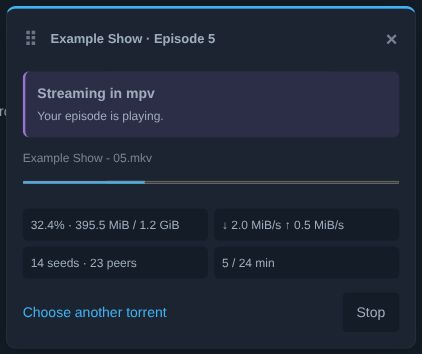

<p align="center"></p>
<h1 align="center">Ani-QW</h1>
<p align="center"><strong>Your anime list. One Play button. mpv.</strong></p>
<p align="center"><a href="https://github.com/v4n00/ani-qw/releases">Downloads</a> · <a href="#install">Install</a> · <a href="docs/protocol.md">Protocol</a></p>

Watch from AniList in mpv on Linux. A Chromium extension adds a Play button underneath an anime's Watching / Add to List controls. A small Go process finds a Nyaa torrent and streams the selected video to mpv.

No desktop window, web dashboard, login-time service, or separate torrent client is required. The helper runs only when needed. Playback continues if you close the browser.

## Made for your watchlist

- **Stay on AniList.** Native-looking controls, watched-episode colors and a compact episode picker.
- **Stream in mpv.** Automatic release selection, or choose a torrent and batch file yourself.
- **Keep track.** A movable playback panel with clear states, transfer statistics, Stop and Replay.
- **Sync progress.** Watched episodes are queued reliably, even when the browser closes.

<p align="center"></p>
<p align="center"><em>Actual extension UI with synthetic demonstration data.</em></p>

## Install

**Linux · mpv · Chromium** — native browser packages only; Flatpak and Snap are not supported.

Install prerequisites on Arch:

```sh
sudo pacman -S mpv curl
```

Install the latest release with:

```sh
curl -fsSL https://raw.githubusercontent.com/v4n00/ani-qw/master/install.sh | bash
```

The Bash installer downloads the matching Linux x86_64 or ARM64 release, checks its SHA-256 checksum, installs the helper for your user, and places the extension in `~/.local/share/ani-qw/extension` (or `$XDG_DATA_HOME/ani-qw/extension`). No sudo is used by the installer.

1. Open `chrome://extensions` and enable **Developer mode**.
2. Choose **Load unpacked** and select `~/.local/share/ani-qw/extension`.
3. Open Ani-QW's extension options, select **Get AniList token**, then paste the token and connect.
4. Open an anime on AniList and press **Play Episode N**.

The directory must stay in place. Updates keep the same extension ID and connection. Google Chrome and Brave Origin are optional native-host targets:

```sh
bash install.sh --browser google-chrome
bash install.sh --browser brave-origin
```

Chromium still requires the manual **Load unpacked** step. [Linux supports self-hosted CRX extensions](https://developer.chrome.com/docs/extensions/how-to/distribute/host-on-linux), but this release uses unpacked distribution to retain its stable ID without an available CRX signing key. No browser security settings or enterprise policies are changed.

### Build from source

Requires Go 1.26.2+, Python 3 and mpv. Node is only needed for tests; the plain JavaScript extension has no build step or npm dependencies.

```sh
git clone https://github.com/v4n00/ani-qw.git
cd ani-qw
CGO_ENABLED=0 make build
bash install.sh --from .
```

For a portable release bundle, run `bash scripts/package.sh amd64` (or `arm64`). Archives and checksums are written to `dist/` with source and dependency license notices.

## AniList connection

Click **Get AniList token** in extension settings, authorize Ani-QW, then paste the displayed token and click **Connect with token**. No developer application setup or client secret is needed for users. The shared public client ID is **51034**; its registered redirect is AniList's PIN page (`https://anilist.co/api/v2/oauth/pin`). This uses AniList's [documented Auth Pin flow](https://docs.anilist.co/guide/auth/).

Authorize the same account that is logged into the AniList website. The access token stays in extension storage restricted to trusted extension contexts; it is not sent to the Go helper, Nyaa, page scripts, or mpv. Account mismatches suspend playback and automatic synchronization. Disconnecting removes the extension's saved token.

## Playback

- **Play Episode N** fetches your current AniList progress before choosing the next unwatched aired episode. If caught up, it replays the last aired episode; after finishing a completed show, it starts at episode 1.
- The arrow opens an episode picker and the persistent **Automatically select torrent** toggle. Known unaired episodes are disabled. When availability is unknown, enter an episode number explicitly.
- Automatic selection prefers seeded, English-translated 1080p releases with a credible title, season, and episode match. If no reliable match exists, the manual chooser opens.
- The manual chooser searches Nyaa and shows resolution, size, seeds, and leechers. Choose a torrent, then its video file. A likely episode is highlighted; unusual filenames or absolute numbering may need your judgment.
- A collapsible panel beneath the navigation shows downloading, buffering, playback, and peer statistics. **Choose another torrent** replaces the current selection; **Stop** ends playback.
- Passing 80% of a known video duration marks the episode watched, including seeking beyond that point. Rewatching never reduces AniList progress. Completion records survive browser closure and are acknowledged only after a successful AniList update.
- v1 starts each episode at the beginning and does not autoplay the next episode.

The helper retains up to **20 GiB of allocated torrent data**, evicting the least-recently-used inactive torrents. An active session may exceed the limit temporarily. Sharing and downloading stop when mpv exits. Cached pieces are verified before reuse; sparse file length is not treated as proof of downloaded data.

## Diagnostics and updates

```sh
~/.local/bin/ani-qw doctor chromium
```

Use the same browser argument used during installation. Doctor checks mpv, native-host registration, writable directories, and the worker's protocol handshake.

Default storage locations follow the XDG environment variables:

| Purpose | Default location |
| --- | --- |
| Binary | `~/.local/bin/ani-qw` |
| Cache | `~/.cache/ani-qw` |
| Completion queue and worker log | `~/.local/state/ani-qw` |
| Worker and mpv sockets | `$XDG_RUNTIME_DIR/ani-qw` |
| Chromium native host | `~/.config/chromium/NativeMessagingHosts/co.aniqw.player.json` |
| Brave Origin native host | `~/.config/BraveSoftware/Brave-Origin/NativeMessagingHosts/co.aniqw.player.json` |

If the helper cannot connect, verify the browser argument, extension ID, and binary path with Doctor. If playback stalls, try a better-seeded release. Disk exhaustion requires freeing space on the cache filesystem. Expired AniList authorization requires reconnecting in extension options; pending completion records remain saved.

To update, stop playback and close the browser, rerun the installer, then reopen the browser and reload Ani-QW in `chrome://extensions`. An old worker may remain alive briefly until its clients become idle. To uninstall:

```sh
bash install.sh --uninstall --browser chromium
```

Remove the extension in the browser as well. The command retains downloaded cache and pending completion data. It leaves the binary installed if another supported browser still has a host registration.

## Development and verification

```sh
make test                         # Go race tests and Node tests
make integration                  # real local torrent + generated video + headless mpv
python3 tests/serve_ui.py          # local browser fixture on 127.0.0.1:8765/tests/ui.html
```

Set `NODE=/path/to/node` when Node is not on PATH. Build caches live under ignored `.cache/go/` so interrupted development can resume without starting downloads from scratch.

The Makefile uses the torrent library's `nosqlite` build tag, selecting its BoltDB piece-completion store and avoiding an unnecessary SQLite implementation in this streaming helper. Use the same tag for custom build/test commands. Run `make notices` before distributing binaries.

The integration test needs ffmpeg, mpv, and permission to open loopback sockets. It generates its own video and seeds only over loopback, with trackers, DHT, PEX, and UPnP disabled. The UI fixture uses fake AniList/helper data and provides a **Run UI checks** button; it does not install the extension or touch an account.

Release automation tests the helper and extension, builds Linux x86_64 and ARM64 bundles, and publishes assets when a matching version tag is pushed. See [the release guide](docs/releasing.md). UI fixtures use synthetic data; they do not prove live AniList authorization or network availability.

## Architecture and credits

The extension's service worker owns AniList requests and a Chromium Native Messaging port. A tiny native bridge forwards framed messages to a detached Go worker over a private Unix socket. The worker owns the torrent client, a token-protected loopback HTTP video endpoint, and mpv's private JSON IPC connection. Only the video endpoint uses HTTP; there is no HTTP control API.

See [docs/protocol.md](docs/protocol.md) for the message contract. Inspired by [Seanime](https://github.com/5rahim/seanime) and the supplied Nyaa provider. See [THIRD_PARTY.md](THIRD_PARTY.md) and [LICENSE](LICENSE).
